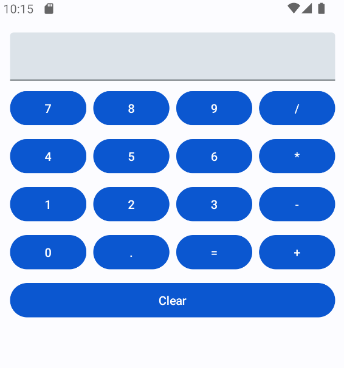

# CI/CD Pipeline mit einer Android App

Dieses Projekt ist ein Beispielprojekt zur Verwendung von GitHub Actions und Erstellung einer Release Pipeline für eine Android Application. Das Projekt ist im Rahmen einer Gruppenarbeit der FH-Joanneum Kapfenberg mit [eigener Angabe und Fragestellungen](./doc/Angabe.md) entstanden.

## Table of Contents

- [CI/CD Pipeline mit einer Android App](#cicd-pipeline-mit-einer-android-app)
  - [Table of Contents](#table-of-contents)
  - [TODOs](#todos)
  - [Git Repository](#git-repository)
  - [Android App - Taschenrechner](#android-app---taschenrechner)
  - [GitHub Actions](#github-actions)
    - [GitHub Action Jobs und Steps](#github-action-jobs-und-steps)
  - [Testing](#testing)
  - [zentrale Fragen](#zentrale-fragen)
  - [Anti-Patterns](#anti-patterns)

## TODOs

Aktuelle TODOs werden separate in [`TODO.md`](./TODO.md) aufgelistet.

## Git Repository

[https://github.com/bschmatz/cicd_android](https://github.com/bschmatz/cicd_android)

## Android App - Taschenrechner

Bei der Beispiel Application handelt es sich um einen einfachen Taschenrechner. Dieser beherrscht derzeit nur die vier Grundrechnungsarten. Anhand dieses Beispielprojektes sollen die nachfolgenden Github Actions angewandt, automatisch getestet und ein Release erstellt werden.

> Taschenrechner nach dem Starten der App
>
> 

## GitHub Actions

Unter [`.github/workflows/kotlin.yml`](./.github/workflows/kotlin.yml) befindet sich die vollständigen für die [GitHub Actions](https://github.com/bschmatz/cicd_android/actions) definierten Jobs und Steps.

Nachfolgend stehen Erklärungen zu den einzelnen Build Jobs und Steps inklusive Beispiel code aus der `kotlin.yml` Datei.

### GitHub Action Jobs und Steps

Die GitHub Actions werden beim Pushen auf Main Branch ausgelöst. Außerdem muss ein Tag, welcher die Version setzt, angegeben werden.

- **Job: lint - Static Code Analysis**
  - Statische Code Analyse mit Hilfe von Lint
  - Verwendet Ubuntu Container
    - **Step 1: Set up JDK 17**
      - JDK 17 aufsetzen mit Hilfe von vordefinierter Action `actions/setup-java@v3`
    - **Step 2: Run Lint**
      - Lint Test starten mit `./gradlew lintDebug`
    - **Step 3: Upload Lint Results**
      - Lint Testergebnisse unter `app/build/reports` speichern

```yml
lint:
    name: Static Code Analysis
    runs-on: ubuntu-latest
    steps:
      - uses: actions/checkout@v4

      - name: Set up JDK 17
        uses: actions/setup-java@v3
        with:
          java-version: '17'
          distribution: 'temurin'
          cache: gradle

      - name: Run Lint
        run: ./gradlew lintDebug

      - name: Upload Lint Results
        if : failure()
        uses: actions/upload-artifact@v3
        with:
          name: lint-reports
          path: app/build/reports
```

---

- **Job: test - Unit Tests**
  - Testen der App mit Hilfe der Unit Tests, welche im Souce Code implementiert sind
  - Verwendung von [JUnit](https://junit.org) in der Implementierung
  - Verwendet Ubuntu Container
  - **Step 1: Set up JDK 17**
    - JDK 17 aufsetzen mit Hilfe von vordefinierter Action `actions/setup-java@v3`
  - **Step 2: Run Tests**
    - Lint Test starten mit `./gradlew testDebug`
  - **Step 3: Upload Test Results**
    - Testergebnisse unter `app/build/reports/tests` speichern

```yml
    name: Unit Tests
    needs: [lint]
    runs-on: ubuntu-latest
    steps:
      - uses: actions/checkout@v4

      - name: Set up JDK 17
        uses: actions/setup-java@v3
        with:
          java-version: '17'
          distribution: 'temurin'
          cache: gradle

      - name: Run Tests
        run: ./gradlew testDebug

      - name: Upload Test Results
        uses: actions/upload-artifact@v3
        with:
          name: test-reports
          path: app/build/reports/tests
```

---

- **Job: build**
  - kompilieren der Android App und Erstellung einer signed APK
  - Verwendet Ubuntu Container
    - **Step 1: Checkout code**
      - Aktuellen Source Stand auschecken
    - **Step 2: Set up Java 17**
      - JDK 17 aufsetzen mit Hilfe von vordefinierter Action `actions/setup-java@v3`
    - **Step 3: Build Android App**
      - Android App mit Hilfe von `sparkfabrik/android-build-action@v1.5.0` builden
      - Project und Output Pfade konfigurieren
      - `assambleRelease` festlegen
    - **Step 4: Sign app APK**
      - signieren der erstellten `APK`
      - GitHub Secrets für Key und Passwörter verwenden
    - **Step 5: Upload Signed APK as Artifact**
      - Hochladen der signierten `APK` als Build Artefakt
    - **Step 6: Create Release**
      - Release in GitHub mit dem Versions Tag erstellen
      - Release Notes erstellen

```yml
runs-on: ubuntu-latest
    needs: test
    steps:
      - name: Checkout code
        uses: actions/checkout@v3

      - name: Set up Java 17
        uses: actions/setup-java@v3
        with:
          java-version: '17'
          distribution: 'temurin'

      - name: Build Android App
        uses: sparkfabrik/android-build-action@v1.5.0
        with:
          project-path: .
          output-path: cicidApp.apk
          browserstack-upload: false
          upload-to-play-store: false
          gradle-task: 'assembleRelease'
          ruby-version: '3.1.0'
          fastlane-version: '2.225.0'

      - name: Sign app APK
        uses: r0adkll/sign-android-release@v1
        id: sign_app
        with:
          releaseDirectory: .
          signingKeyBase64: ${{ secrets.SIGNING_KEY }}
          alias: ${{ secrets.ALIAS }}
          keyStorePassword: ${{ secrets.KEY_STORE_PASSWORD }}
          keyPassword: ${{ secrets.KEY_PASSWORD }}
        if: startsWith(github.ref, 'refs/tags/v')  
        env:
          BUILD_TOOLS_VERSION: "34.0.0"

      - name: Upload Signed APK as Artifact
        uses: actions/upload-artifact@v4
        with:
          name: Signed app bundle
          path: ${{steps.sign_app.outputs.signedReleaseFile}}
        if: startsWith(github.ref, 'refs/tags/v')

      - name: Create Release
        uses: softprops/action-gh-release@v1
        with:
          files: ${{steps.sign_app.outputs.signedReleaseFile}}
          generate_release_notes: true
        if: startsWith(github.ref, 'refs/tags/v')
```

## Testing

Unter [`./app/src/test/java/com/example/androidcicdapp/data/calculator/CalculatorImplTest.kt`](app/src/test/java/com/example/androidcicdapp/data/calculator/CalculatorImplTest.kt) befinden sich die vollständigen implementierten [JUnit](https://junit.org) Testcases, welche mit Hilfe der GitHub Actions ausgeführt werden. Dabei handelt es sich um einfach Überprüfungen der Funktionalität des Taschenrechners.

Beispiel Code:

```Kotlin
@Test
    fun add_isCorrect() {
        val result = calculator.add(17.0, 4.0)
        assertEquals(21.0, result, 0.0)
    }

    @Test
    fun subtract_isCorrect() {
        val result = calculator.subtract(10.0, 1.5)
        assertEquals(8.5, result, 0.0)
    }

    @Test
    fun multiply_isCorrect() {
        val result = calculator.multiply(5.0, 5.0)
        assertEquals(25.0, result, 0.0)
    }

    @Test
    fun divide_isCorrect() {
        val result = calculator.divide(99.0, 33.0)
        assertEquals(3.0, result, 0.0)
    }
```

## zentrale Fragen

- *Was ist notwendig zur Build-Automatisierung?*

  Zur Build-Automatisierung werden GitHub Actions und die damit verbundene Konfigurationdatei [`./.github/workflows/kotlin.yml`](.github/workflows/kotlin.yml) benötigt.

- *Welchen Vorteil liefert Testautomatisierung in CI/CD-Pipelines?*

  Der wohl größte Vorteil liegt in der Übersichtlichkeit beziehungsweise der genauen Aufschlüsselung jedes einzelnen Build-Steps in Form von Logs oder sogar eigenen Reports. Zusätzlich ergibt sich für Entwickler kein Mehraufwand bei der Release oder Test Erstellung. Dank der Pipeline werden neue Features sofort getestet und bereitgestellt.

- *Wozu dient Containerization in der Entwicklung und in CI/CD-Pipelines?*

  Containerization dient zur Vermeidung von Fehlerquellen wie "*It runs on my machine*" und zur flexibleren Konfiguration der verwendeten Compiler und Build-Tools. Versionen und Dependencies können so einfacher gehandhabt werden.

- *Wie kann Infrastructure as Code dabei unterstützen?*

  Infrastructure as Code ermöglicht eine einfache Konfiguration eines komplexen Build-Systems und sorgt für wenige manuelle Handgriffe, um Einstallungen am System vorzunehmen. Dadurch ist die Fehleranfälligkeit des Gesamtprozesses deutlich verringert.

- *Welche Schritte in einer CI/CD-Pipeline müssen beachtet werden?*

  Die Pipeline dieses Projekts besteht aus einer Static Code Analysis, Unit tests, welche zuvor korrekt implementiert werden müssen, dem eigentlich Compile Prozess und dem Erstellen einer APK-Datei.

- *Wie sieht eine Delivery/Deployment-Strategie aus?*

  Für ein Deployment ist ein Git Tag notwendig, welcher einem Sourcestand eine Version zuweist. Im Zuge des Deployments wird dann ein Release mit der aktuellen Version inklusive Release Notes erstellt. Im besten Fall wird bei der Entwicklung auf einen Trunk Based Workflow gesetzt, damit neue Features schnell auf den eigentlichen Hauptbranch gelangen und dort automatisch kompiliert und getestet werden.

- *Was muss eigentlich "ausgeliefert" werden?*

  Im Fall einer Android Application muss eine (signierte) `.apk` Datei ausgeliefert werden, welche nach dem Deployment beispielsweise auf einem Emulator installiert werden kann.

- *Welche Umgebung ist notwendig zum Ausführen bzw. zur Bereitstellung des jeweiligen Themas?*

  Für die GitHub Actions werden Ubuntu Docker Container verwendet, auf welchen der aktuelle Sourcecode kompiliert wird. Lokal ist ein kompilieren und testen der App mit Android Studio möglich.

## Anti-Patterns
Eine Verrausetzung für diesen Teil ist das man die gennanten Anti-Patterns kennt. 

### Vernachläsigte Anti-Patterns
Anti-Patterns, die keinen negativen Effekt verurachen, da der Rahmens des Projektes zugering ist:
- Infrequent Check-In
- Bottleneck Commits
- Bloated Build
- Polluted Environment
- Slow Machine
- Continuous Ignorance


Da durch das GitHub verwendet wurde um das Repository remote zu speichern und wir kein Unternehmen sind,
muss jeder seine Feedback selbst einstellen.
- Impeding action with minimal feedback
- Spam Feedback  

### Abgewendete Anti-Patterns

#### Broken Build
Es wurde ausgeschalten das auf den main gepushed werden kann, um alle dazu zu zwingen ein ihren eigenen Branches zu arbeiten.  
Statt dessen muss ein Pull-Request erstellt werden um seine Änderungen auf den main zu bekommen.  

#### IDE-only Build
Die Pipeline wird automatisch ausgeführt wenn ein neues commit auf den main Branch gepushed wird.
In dieser Pipeline werden der Build und die Tests ausführt.

#### Works on My Machine
Diese Pattern wird durch das beim "IDE-only Build" genannten vermieden.

#### Scheduled Builds
In diesme Prjekt gibt es keine "Scheduled Builds".
